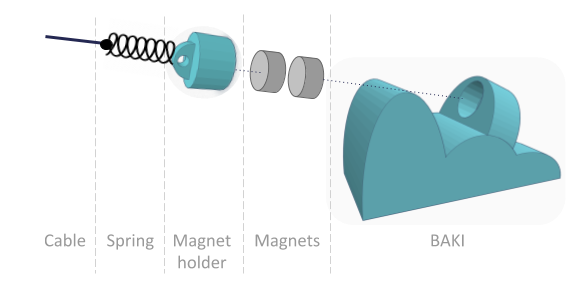
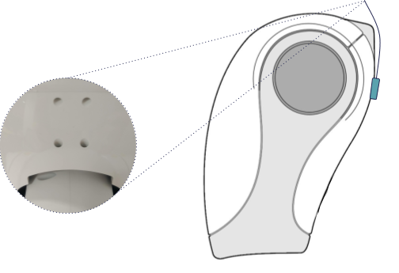

# baki-holder

### This repository contains the .stl files to 3D print a BAKI (BAcklash KIller) holder in order to mitigate the undesired movement in Pepper's neck.
### The system is composed by the magnet holder and the BAKI components specified in the schema:

#### Printing suggestions:

**- Support material:** No

**- Resolution:** 0.1

**- Infill:** 100

#### Installation in Pepper:

1- Attach the holder using 2xM2 or M2.5 screws to the back.

2- Install a pair of magnets (the model uses the same model present in Pepper's back).

3- Use a semi-rigid cable to facilite the magnets to encounter.

